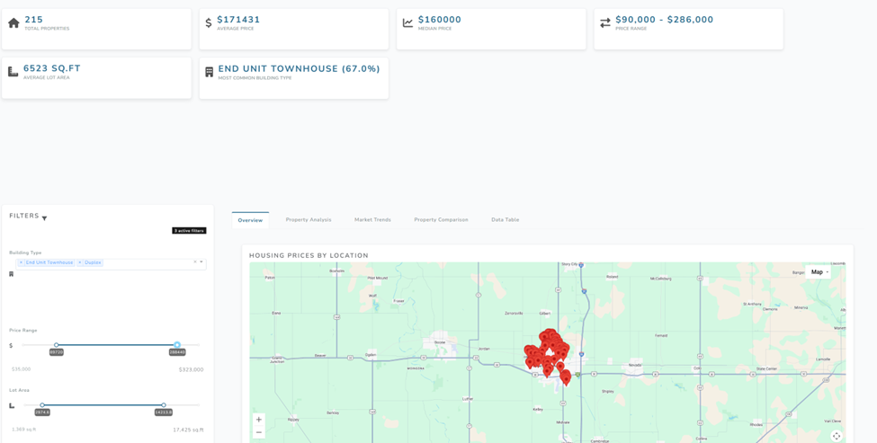

# Housing Data Dashboard

A Dash-based interactive dashboard for analyzing housing data.

## Features

- Interactive map visualization of housing data
- Price distribution analysis
- Property feature comparisons
- Market trend analysis
- Advanced correlations and statistical insights

## Live Demo

The dashboard is deployed on Render:

https://data-visualization-assignment.onrender.com/

*Note: If the Render instance is sleeping, the first load may take up to a minute.*

## Screenshots

Below are a few highlights from the app. Place the images in `docs/screenshots/` with the filenames shown to render them on GitHub.

1) Filters panel and active filters count


- Multi-select building type filter
- Interactive price and lot-area range sliders
- One-click Reset Filters button and live “active filters” badge

2) Overview with key metrics and tabs



- Summary KPIs: total properties, average/median price, price range, and most common building type
- Navigation tabs for Overview, Property Analysis, Market Trends, Property Comparison, and Data Table

3) Interactive map with Google Maps markers and rich tooltips


- Click markers to see price, type, area, and year built
- Pan/zoom and change map style using the built-in Google Maps controls

4) Price vs. Area by category with trendline


- Scatter plot grouped by building type
- Hover tooltips with exact values and an overall trendline for quick insight

## Installation

1. Clone this repository:
```bash
git clone https://github.com/Danik911/data-visualization-assignment.git
cd data-visualization-assignment
```

2. Create and activate a virtual environment:
```bash
# Windows
python -m venv .venv
.venv\Scripts\activate

# macOS/Linux
python -m venv .venv
source .venv/bin/activate
```

3. Install dependencies:
```bash
pip install -r requirements.txt
```

4. Set up environment variables:
Create a `.env` file in the root directory with the following:
```
GOOGLE_MAPS_API_KEY=your_google_maps_api_key
```
*Important: You need a Google Maps API key with Maps JavaScript API enabled*

## Usage

Run the dashboard:
```bash
python run_dashboard.py
```

The dashboard will be available at: http://localhost:8050

## Project Structure

- `dashboard/dash_app.py`: Main Dash application setup
- `dashboard/layout.py`: Dashboard layout components
- `dashboard/callbacks.py`: Interactive callback functions
- `dashboard/visualizations.py`: Visualization functions
- `dashboard/config.py`: Configuration settings
- `data/`: Housing data and metadata
- `run_dashboard.py`: Entry point script

## Deployment Options

While GitHub Pages hosts this code repository, to deploy the live dashboard you can use:

- [Render](https://render.com/)
- [Heroku](https://www.heroku.com/)
- [PythonAnywhere](https://www.pythonanywhere.com/)
- [AWS Elastic Beanstalk](https://aws.amazon.com/elasticbeanstalk/)

Currently deployed on Render at:

https://data-visualization-assignment.onrender.com/

## Contributing

Contributions are welcome! Please feel free to submit a Pull Request.
